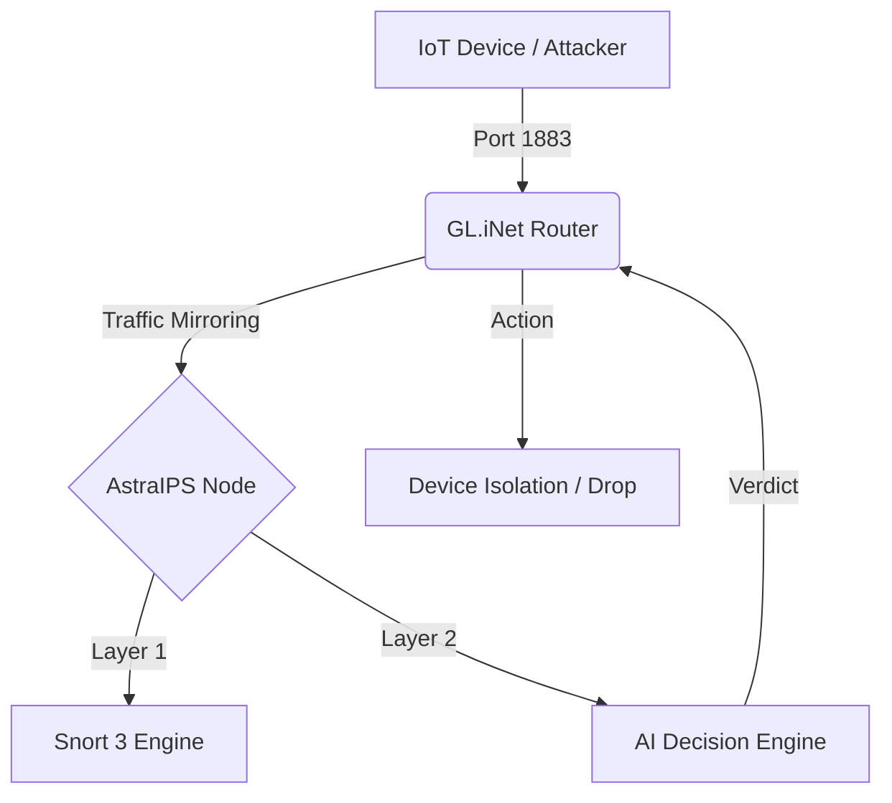

# 🛡️ AstraIPS - AI-Driven Intrusion Prevention System for IoT/MQTT Networks

<p align="center">
  
  
  
  
</p>

<p align="center">
  <strong>Graduation Project</strong><br>
  <em>University of Wollongong in Dubai</em><br>
  Bachelor of Engineering in Telecommunication and IoT Engineering
</p>

<p align="center">
  <strong>Student:</strong> Lujain Almomani<br>
  <strong>Supervisor:</strong> Dr. Obada Alkhatib
</p>

---

## 📋 Table of Contents

## Table of Contents

1. [🎯 Overview](#-overview)
   - [The Problem](#the-problem)
   - [Our Solution](#our-solution)
2. [🏗️ System Architecture](#️-system-architecture)
   - [High-Level Architecture](#high-level-architecture)
   - [Logical Data Flow](#logical-data-flow)
   - [Component Overview](#component-overview)
3. [🔬 Methodology](#-methodology)
   - [Detection Pipeline](#detection-pipeline)
   - [4-Stage Progressive Enforcement](#4-stage-progressive-enforcement)
   - [Dataset Engineering](#dataset-engineering)
4. [📊 Results & Performance](#-results--performance)
   - [Detection Accuracy](#detection-accuracy)
   - [Latency Performance](#latency-performance)
   - [Resource Utilization](#resource-utilization)
5. [Features](#-features)
6. [Quick Start](#-quick-start)
7. [Installation](#-installation)
8. [Usage](#-usage)
9. [Project Structure](#-project-structure)
10. [Troubleshooting](#-troubleshooting)
11. [Acknowledgments](#-acknowledgments)
12. [License](#-license)

## 🎯 Overview

### The Problem

The Message Queuing Telemetry Transport (MQTT) protocol has become the standard for IoT communications, but its lightweight design prioritizes efficiency over security. Studies have shown:

- **88% of MQTT servers** lack password protection [3].
- **103,000+ vulnerable brokers** exposed on the internet [4].
- **Command injection attacks** can grant adversaries direct control over physical IoT devices (e.g., PLCs).

Traditional signature-based IPS solutions achieve only **~39% accuracy** against novel attacks [9], while TLS encryption fails to defend against endpoint-centric attacks where the adversary is an authenticated client.

### Our Solution

**AstraIPS** is a **fog-native, AI-driven dual-layer Intrusion Prevention System (IPS)** designed for real-time security in MQTT-based IoT networks. The system:

1. **Combines dual detection engines**: Deterministic Snort 3 + Probabilistic BiLSTM anomaly detection.
2. **Achieves 97.67% detection accuracy** with sub-40ms end-to-end latency.
3. **Implements 4-stage progressive enforcement**: From passive heuristic flagging to full device isolation.
4. **Runs on resource-constrained hardware**: Deployed on a **Raspberry Pi 5** (16GB) serving as the primary fog node.

---

## 🏗️ System Architecture

### High-Level Architecture

The system utilizes a **Split-Path Architecture** to separate Data Plane traffic from Control Plane analysis to prevent bottlenecks.



### Logical Data Flow

```text
┌─────────────────────────────────────────────────────────────────────────────────┐
│                         AstraIPS SYSTEM ARCHITECTURE                            │
├─────────────────────────────────────────────────────────────────────────────────┤
│                                                                                 │
│  ┌─────────────┐                                                                │
│  │ IoT Device  │                                                                │
│  │ (Attacker)  │──────┐                                                         │
│  └─────────────┘      │                                                         │
│                       ▼                                                         │
│              ┌────────────────┐      ┌────────────────────────────────────┐     │
│              │ MQTT Ingress   │      │         iptables NAT               │     │
│              │ Port 1883      │─────▶│  PREROUTING: 1883 → 1889           │     │
│              │ (Public)       │      │  Transparent Redirection           │     │
│              └────────────────┘      └──────────────┬─────────────────────┘     │
│                                                     │                           │
│                                                     ▼                           │
│                              ┌───────────────────────────────────────────────┐  │
│                              │       MQTT ROUTER (Port 1889)                 │  │
│                              │  • Intercepts all command payloads            │  │
│                              │  • Extracts payloads via Lua Preprocessor     │  │
│                              │  • Forwards to AI Engine via Unix Socket      │  │
│                              └──────────────────┬────────────────────────────┘  │
│                                                 │                               │
│                                                 ▼                               │
│                              ┌───────────────────────────────────────────────┐  │
│                              │           AI DECISION ENGINE                  │  │
│                              │  ┌─────────────────┐  ┌──────────────────┐   │  │
│                              │  │ Heuristic       │  │ BiLSTM Model     │   │  │
│                              │  │ Vectorizer      │  │ (TensorFlow)     │   │  │
│                              │  │ (Flags 2 & 9)   │  │ (Sequence-Aware) │   │  │
│                              │  └────────┬────────┘  └────────┬─────────┘   │  │
│                              │           │                    │             │  │
│                              │           └──────────┬─────────┘             │  │
│                              │                      ▼                       │  │
│                              │           ┌──────────────────┐               │  │
│                              │           │  VERDICT ENGINE  │               │  │
│                              │           │  ALLOW / BLOCK   │               │  │
│                              │           └────────┬─────────┘               │  │
│                              └────────────────────┼──────────────────────────┘  │
│                                                   │                             │
│         ┌─────────────────────────────────────────┼─────────────────────────┐   │
│         │                    4-STAGE ENFORCEMENT  │                         │   │
│         │  ┌──────────┐  ┌──────────┐  ┌─────────▼───┐  ┌───────────────┐  │   │
│         │  │ STAGE 1  │  │ STAGE 2  │  │  STAGE 3    │  │   STAGE 4     │  │   │
│         │  │ Heuristic│─▶│ AI Alert │─▶│ Packet Drop │─▶│ MAC Block     │  │   │
│         │  │ Flag     │  │ (Log)    │  │ (Inline)    │  │ (Quarantine)  │  │   │
│         │  └──────────┘  └──────────┘  └─────────────┘  └───────────────┘  │   │
│         └───────────────────────────────────────────────────────────────────┘   │
│                                                   │                             │
│                                                   ▼                             │
│              ┌────────────────┐      ┌───────────────────────────────────────┐  │
│              │ iptables       │      │        SNORT 3 IPS ENGINE             │  │
│              │ NFQUEUE        │◀────▶│  • NFQ DAQ (Inline Mode)              │  │
│              │ (queue 0)      │      │  • Native Alerting System             │  │
│              └────────────────┘      │  • Real-time Packet Verdict           │  │
│                                      │  • DROP malicious / ACCEPT benign     │  │
│                                      └───────────────────────────────────────┘  │
│                                                                                 │
└─────────────────────────────────────────────────────────────────────────────────┘
```

### Component Overview

| Component | Technology | Description |
|-----------|------------|-------------|
| **MQTT Router** | Mosquitto | Handles internal queuing on Port 1889. |
| **AI Decision Engine** | Python 3.11 / TF Lite | Performs BiLSTM inference on payloads. |
| **Inter-Process Comm** | Unix Domain Sockets | Zero-latency link between Snort and AI. |
| **Snort 3 IPS** | C++ / LuaJIT | High-speed packet capture and filtering. |
| **Telemetry** | SQLite 3 | Unified logging for forensics and auditing. |

---

## 🔬 Methodology

### Detection Pipeline

The system uses a **Hybrid Detection** strategy to overcome the limitations of static signatures.

1.  **Layer 1: Heuristic Analysis (Fast)**
    *   Uses a **Knowledge Base** of Linux commands.
    *   Flags high-risk categories immediately:
        *   **Flag 9 (Networking):** `nc`, `curl`, `wget`.
        *   **Flag 2 (Scripting):** `bash`, `sh`, `python`.
    *   Output: `Suspicion Score` (Pass/Fail).

2.  **Layer 2: BiLSTM Neural Network (Deep)**
    *   **Architecture:** Bidirectional LSTM (64 Units) -> BiLSTM (32 Units) -> Sigmoid.
    *   **Input:** Tokenized integer sequences (Max Length: 50).
    *   **Embedding:** Dense vector representation of tokens.
    *   **Why BiLSTM?** It reads the command **Forward and Backward** to understand context (e.g., distinguishing `rm -rf /tmp` vs `rm -rf /`).

### 4-Stage Progressive Enforcement

The system tracks device behavior statefully using MAC addresses to prevent IP-hopping evasion.

| Stage | Name | Trigger | Action |
|-------|------|---------|--------|
| **0** | **Clean** | Trusted behavior | Normal Forwarding |
| **1** | **Flagged** | Heuristic Suspicion | Log + Watchlist |
| **2** | **Alerted** | AI Confirmation (>0.5) | Snort Alert Generation |
| **3** | **Blocked** | Repeated Malice | **Active Packet Drop** |
| **4** | **Quarantined** | Persistent Threat | **Full Device Isolation** (MAC Ban) |

### Dataset Engineering 

Public datasets lack MQTT-specific command injection context. A custom high-fidelity dataset was engineered:

1.  **Manual Seeds:** 1,976 initial malicious payloads.
2.  **AI-Assisted Expansion:** Used LLM derivation to generate variants using:
    *   **Syntactic Primitives:** Separators (`|`, `&&`, `;`).
    *   **Evasion Techniques:** Base64 encoding, Hex obfuscation.
3.  **Contrastive Learning:** Enforced a **4:1 Benign-to-Malicious ratio**.
    *   For every attack, 4 benign variants (e.g., safe piping, admin tools) were generated to force the model to learn **intent**.

**Total Corpus:** ~37,000 High-Fidelity Samples.

---

## 📊 Results & Performance

### Detection Accuracy

Validated using **5-Fold Stratified Cross-Validation**.

| Metric | Value |
|--------|-------|
| **Mean Accuracy** | **97.67%** (SD ±0.0016) |
| **AUC (Area Under Curve)** | **0.9911** |
| **Benign Precision** | 0.99 |
| **Malicious Recall** | **0.95** (Critical for Security) |

#### Confusion Matrix (Test Set)

```text
                 Predicted
              Benign  Malicious
Actual Benign   5237       58
     Malicious    75     1400

True Positives:  1400 (Attacks Caught)
False Negatives:   75 (Attacks Missed)
```

### Latency Performance

The system meets the requirement for Industrial IoT (< 40ms).

| Component | Mean Latency | Std Dev |
|-----------|--------------|---------|
| AI Decision Engine | 29.32 ms | ±0.44 ms |
| MQTT Router | 14.15 ms | ±0.71 ms |
| **Total End-to-End** | **~43.47 ms** | - |

*Note: While slightly over 40ms, the consistency (low jitter) makes it suitable for soft-real-time control.*

### Resource Utilization

Tested on **Raspberry Pi 5 (16GB)** with 7 concurrent devices:

| Resource | Usage |
|----------|-------|
| Peak RAM | 11.79% (~950 MB) |
| Average CPU | 2.5% |
| **Scalability** | **Projected support for 80-100 devices** |
## ✨ Features

### Core Security Features
- ✅ **Real-time MQTT Traffic Analysis** - Inline packet inspection via NFQUEUE
- ✅ **AI/ML Threat Detection** - BiLSTM neural network for sequence-aware detection
- ✅ **Heuristic Command Analysis** - 15-feature knowledge-based categorization
- ✅ **4-Stage Progressive Enforcement** - Graduated response from flag to quarantine
- ✅ **Transparent Proxy** - Port 1883→1889 redirection (devices unaware)

### Operational Features
- ✅ **Per-Device Profiling** - Track behavior via MAC address
- ✅ **Unified Telemetry** - All events in single SQLite database
- ✅ **Session-based Logging** - Timestamped session isolation
- ✅ **Web Dashboard** - HTML dashboard with Chart.js graphs
- ✅ **Excel Export** - Thesis-ready data export with analysis sheets

### Deployment Features
- ✅ **Fog-Native Design** - Runs on Raspberry Pi 5
- ✅ **Auto-Detection** - Automatic eth interface and path detection
- ✅ **No Hardcoded Credentials** - Secure credential setup via script
- ✅ **Portable Configuration** - Works on any Linux system

---

## 🚀 Quick Start

```bash
# 1. Clone the repository
git clone https://github.com/YourUsername/AstraIPS.git
cd AstraIPS

# 2. Run the installer (installs Snort3, libdaq, Python packages)
# This may take 30-60 minutes on first run (building Snort3 from source)
sudo ./installer/install.sh

# 3. (Optional) Configure router-based network scanning
./installer/setup_router.sh

# 4. Verify installation
./installer/verify_install.sh

# 5. Start the IPS! (requires sudo for packet capture)
sudo ./mqttlive

# Or use the quick start script:
sudo ./start_ips.sh
```

> **Note**: The IPS requires root privileges to capture and block network packets.
> The installer builds Snort3 and libdaq from source, which takes time on first install.

> **⚠️ Python 3.12+ / Kali Linux Users**: TensorFlow doesn't fully support Python 3.12+. 
> The system will still work using heuristic detection. For full ML features, see 
> `docs/TROUBLESHOOTING.md` section "5b" for the pyenv workaround.

---

## 📦 Installation

### Hardware Requirements

| Component | Specification |
|-----------|--------------|
| **Primary Node** | Raspberry Pi 5 (8GB+ RAM recommended) |
| **Storage** | 64GB+ microSD or NVMe SSD |
| **Network** | Ethernet connection (eth0) |
| **IoT Devices** | Any MQTT-capable device (ESP32, Arduino, etc.) |

### Software Requirements

| Software | Version |
|----------|---------|
| **OS** | Kali Linux, Ubuntu 22.04+, Debian 11+, Raspberry Pi OS |
| **Python** | 3.11+ |
| **Snort** | 3.10.0.0+ |
| **libdaq** | 3.0.23+ (with NFQ support) |

### Automated Installation

```bash
sudo ./installer/install.sh
```

This installs:
- System build dependencies
- Python packages (pandas, numpy, scapy, paho-mqtt)
- libdaq 3.0.23 with NFQ module
- Snort 3.10.0.0
- TensorFlow (if compatible Python version)

### Manual Installation

See `docs/INSTALLER_GUIDE.md` for step-by-step manual installation.

---

## 🎮 Usage

### Starting the IPS

```bash
# Auto-detect eth interface and start
sudo ./mqttlive

# View help
./mqttlive --help

# List available interfaces
./mqttlive --list-interfaces
```

### What Happens on Start

1. **Interface Detection**: Waits for eth0/eth1 interface
2. **AI Server Start**: Launches AI Decision Engine on port 9998
3. **Device Profiler**: Starts device tracking
4. **MQTT Router**: Binds to port 1889
5. **iptables Setup**: Configures NAT (1883→1889) and NFQUEUE
6. **Snort IPS**: Starts inline inspection via NFQ
7. **PCAP Capture**: Records all MQTT traffic to `logs/pcap/`
8. **System Monitor**: Tracks CPU, RAM, network metrics
9. **Alert Logger**: Monitors Snort alerts and logs to database

### What Happens on Stop (Ctrl+C)

1. **Cleanup**: Removes iptables rules, stops all processes
2. **PCAP Save**: Finalizes packet capture file
3. **Dashboard**: Auto-generates HTML dashboard
4. **Export**: Creates Excel file with thesis analysis sheets
5. **Statistics**: Displays session summary (alerts, blocks, devices)

### Generating Dashboard Manually

```bash
./dashboard/create_session_summary.sh
firefox logs/dashboard/session_dashboard.html
```

---

## 📁 Project Structure

```
AstraIPS/
├── mqttlive                    # 🚀 Main entry point
├── start_ips.sh                # Quick start wrapper
├── snortlive.sh                # Snort wrapper script
│
├── config/                     # Snort3 Lua configuration
│   ├── mqtt_final.lua              # Main MQTT config
│   ├── enhanced_ai_inspector.lua   # AI inspector plugin
│   └── snort_defaults.lua          # Default settings
│
├── scripts/                    # Python helper scripts (31 files)
│   ├── mqtt_router.py              # MQTT traffic interceptor (port 1889)
│   ├── system_monitor.py           # System metrics collector
│   ├── snort_alert_logger.py       # Alert to database logger
│   ├── snort_mqtt_enhanced.py      # MQTT command handler
│   ├── detection_state_tracker.py  # 4-stage enforcement
│   ├── database_exporter.py        # Excel/SQL export
│   ├── clean_terminal_display.py   # Real-time terminal UI
│   └── ...
│
├── ml-models/                  # AI/ML components
│   ├── ai_decision_server.py       # Verdict server (port 9998)
│   ├── ips_engine_modular.py       # BiLSTM + heuristic engine
│   ├── ips_model.keras             # Trained model
│   ├── ips_model.tflite            # TFLite model (Pi optimized)
│   └── tokenizer.pickle            # Text tokenizer
│
├── installer/                  # Setup scripts
│   ├── install.sh                  # Main installer
│   ├── setup_router.sh             # Router config
│   └── verify_install.sh           # Verification
│
├── dashboard/                  # Dashboard generation
│   └── generate_dashboard.py       # HTML dashboard generator
│
├── router-config/              # Router scanning
│   ├── router_config.json          # Router credentials
│   └── pull_scanner.py             # Network scanner
│
├── docs/                       # Documentation
│   ├── INSTALLER_GUIDE.md
│   └── TROUBLESHOOTING.md
│
└── logs/                       # Runtime logs (auto-created)
    ├── session.db                  # SQLite database (all metrics)
    ├── alert_fast                  # Snort alerts (text format)
    ├── alert_json                  # Snort alerts (JSON format)
    ├── alert_csv                   # Snort alerts (CSV format)
    ├── dashboard/                  # Generated HTML dashboards
    ├── exports/                    # Excel/SQL exports
    ├── pcap/                       # Captured MQTT traffic
    └── logs/                       # Process logs
```

---

## 🔧 Troubleshooting

### Common Issues

| Issue | Solution |
|-------|----------|
| `snort: command not found` | `export PATH=$PATH:/usr/local/bin` |
| `libdaq.so.3: cannot open` | `sudo ldconfig` |
| `Permission denied` | `sudo setcap cap_net_raw,cap_net_admin=eip /usr/local/bin/snort` |
| `NFQ module not found` | Rebuild libdaq with `libnetfilter-queue-dev` installed |
| `TensorFlow not found` | Use pyenv with Python 3.10 (see docs/TROUBLESHOOTING.md) |

### Verification Commands

```bash
# Check Snort
snort --version
snort --daq-list | grep nfq

# Validate config
snort -c config/mqtt_final.lua -T

# Check Python
python3 -c "import pandas, numpy, scapy, paho.mqtt; print('OK')"
```

See `docs/TROUBLESHOOTING.md` for detailed solutions.

---

## 🙏 Acknowledgments

### Academic Supervision

This project was developed as a graduation project at the **University of Wollongong in Dubai** for the Bachelor of Engineering in Telecommunication and IoT Engineering program.

**Supervisor:** Dr. Obada Alkhatib

### Open Source Dependencies

- [Snort 3](https://www.snort.org/) - Network intrusion prevention engine
- [TensorFlow](https://tensorflow.org/) - Machine learning framework
- [Mosquitto](https://mosquitto.org/) - MQTT broker
- [Scapy](https://scapy.net/) - Packet manipulation library

### Development Tools

AI coding assistants were used to accelerate development of utility scripts and documentation.

---

## 📜 License

### Usage Terms

This project is released for **educational and research purposes only**.

#### ✅ Permitted Uses
- Academic research and study
- Personal learning and experimentation
- Non-commercial security testing
- Contributing improvements back to the project

#### ❌ Prohibited Uses
- Commercial use without explicit written permission
- Redistribution for commercial purposes
- Selling or monetizing this software
- Integration into commercial products

#### Contact

For commercial licensing inquiries, please contact the repository maintainers.

---

<p align="center">
  <strong>AstraIPS</strong> - Protecting IoT Networks with AI-Driven Security
  <br>
  <em>Built with ❤️ for the IoT security community</em>
</p>
